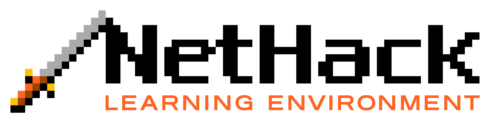
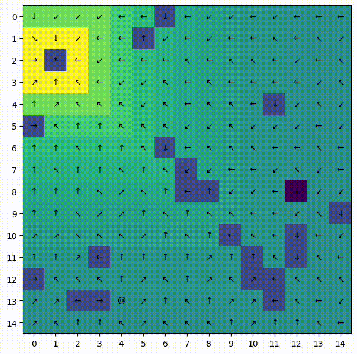

# minihack-evoution




## Introduction
This repository contains the code for the project of the course Artificial Intelligence Fundamentals @Unipisa.
The goal of the project is to train an agent to play the game NetHack, with the help of the [NLE](https://github.com/facebookresearch/nle) 
interface, which allows to interact with the game through OpenAI Gym, and the [Minihack](https://github.com/facebookresearch/minihack) environment, which provides a
variegated zoo of environments to train on.

In order to train the agent, we used genetic algorithms, which are a class of evolutionary algorithms that mimic the process of natural selection.

## Installation
To install Nethack Learning Environment, follow the instructions [here](https://github.com/facebookresearch/nle#installation).
MiniHack can be installed with pip:
```bash
pip install minihack
```
once the NLE is installed.

The code we wrote does not require any additional installation, aside from `numpy` and `matplotlib`.

## Task
We mainly focused on the `MiniHack-Room-Random-15x15` environment, which is a gridworld environment where the agent has to reach a goal position in the map.

#### Run example
<p align="center">
  


## Genetic Algorithm
The initial population is composed of individuals that are randomly generated grids of size $15 \times 15$, where each cell has a random movement.
Applying a classic genetic algorithm, we show that after some generations the rules of the game are learned and the agent is able to reach the goal position.


## Authors
- [Vincenzo Gargano](https://github.com/U-n-Own)
- [Giacomo Lagomarsini](https://github.com/g-lago8)
- [Angelo Nardone](https://github.com/Angelido)


Students of the Master's Degree in Computer Science at the University of Pisa.